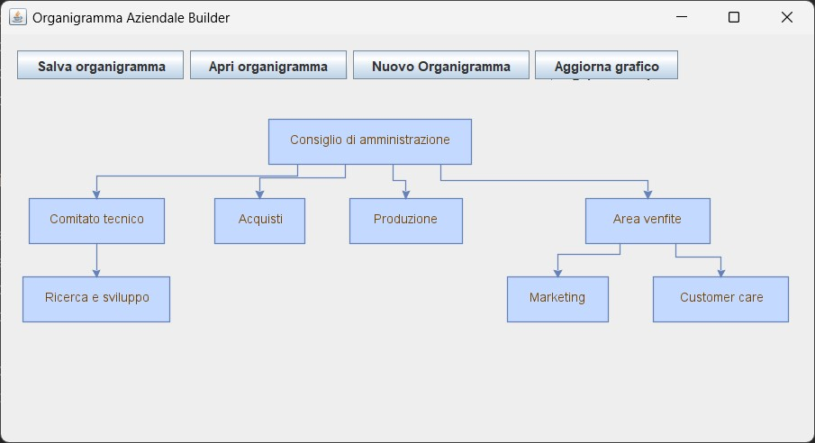

# Organigramma Aziendale Builder

## Descrizione
Organigramma Aziendale Builder è un'applicazione Java che consente di creare, modificare e visualizzare organigrammi aziendali in modo semplice e intuitivo. Permette di aggiungere dipendenti, creare unità e organi di gestione, e di salvare e aprire organigrammi in formato XML.

## Funzionalità
- Creazione di un nuovo organigramma aziendale.
- Aggiunta, modifica ed eliminazione di unità e organi di gestione.
- Aggiunta e gestione di dipendenti con ruoli.
- Visualizzazione dinamica dell'organigramma.
- Salvataggio e caricamento dell'organigramma in formato XML.

## Screenshot


## Prerequisiti
- Java 21
- Librerie esterne utilizzate:
  - JGraphX per la visualizzazione del grafo
  - JUnit (se sono presenti test unitari)

## Installazione

1. Clona questo repository:

   ```bash
   git clone https://github.com/riccardo-florio/organigramma_aziendale.git
   ```

2. Importa il progetto in un IDE come IntelliJ IDEA o Eclipse.

3. Assicurati di avere le librerie JGraphX nel classpath.

4. Esegui il file MainWindow.java per avviare l'applicazione.


## Utilizzo

Una volta avviato il programma, puoi:
- Aggiungere unità o organi di gestione facendo doppio clic su una cella del grafo.
- Salvare l'organigramma in formato XML tramite l'opzione "Salva organigramma".
- Caricare un organigramma salvato tramite "Apri organigramma".
- Creare un nuovo organigramma selezionando "Nuovo Organigramma".
